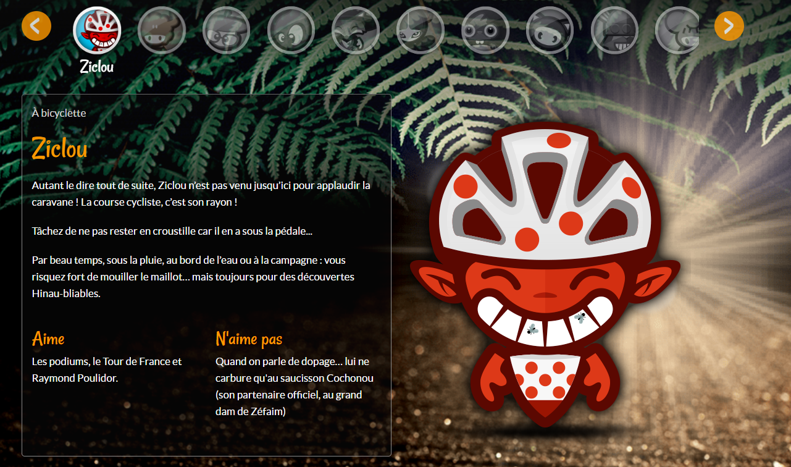
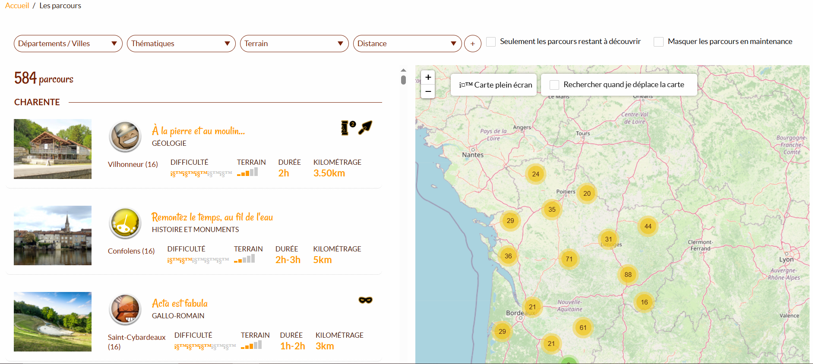
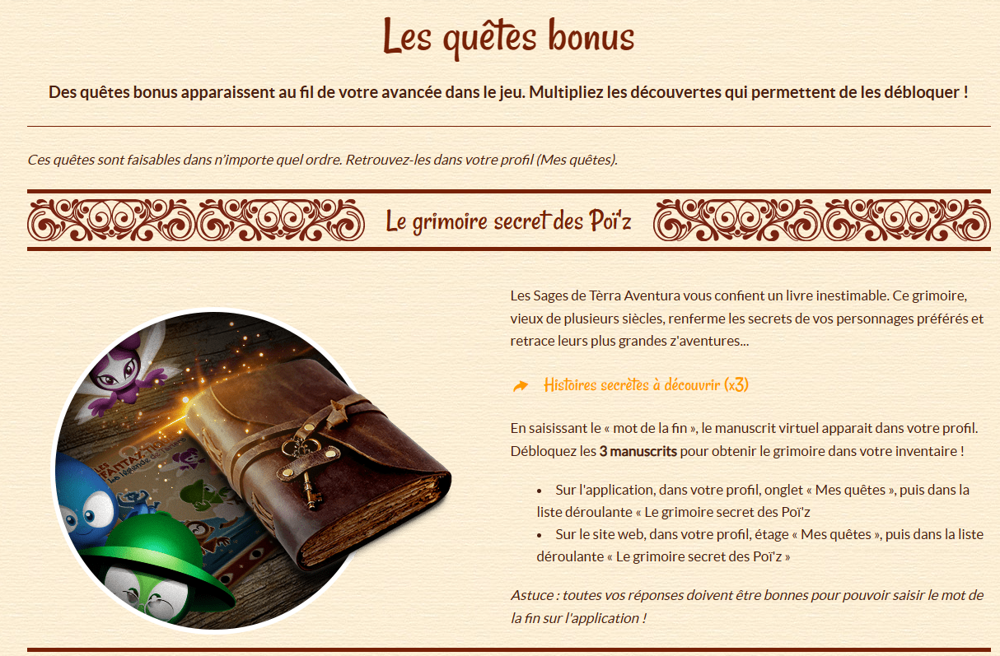
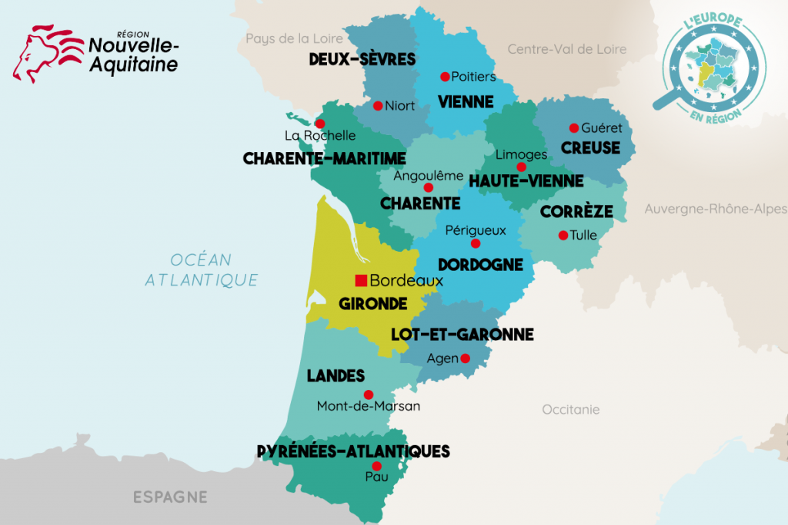
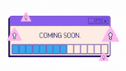

# Solution caches Tèrra Aventura

## Sommaire

1. [Présentation](#presentation)
    - [Nom d'un Poï'z, qu'est-ce que Tèrra Aventura ?](#poizTerraAventura)
    - [Règlement Tèrra Aventura](#reglement)
    - [L'heure de la première aventure est arrivée !](#premiereAventure)
    - [Et pour poursuivre davantage l'aventure ?](#poursuiteAventure)
2. [Aides caches Tèrra Aventura](#aides)
   - [Aides Tèrra Aventura - (16) Charente](#charente)
   - [Aides Tèrra Aventura - (17) Charente-Maritime](#charenteMaritime)
   - [Aides Tèrra Aventura - (19) Corrèze](#correze)
   - [Aides Tèrra Aventura - (23) Creuse](#creuse)
   - [Aides Tèrra Aventura - (24) Dordogne](#dordogne)
   - [Aides Tèrra Aventura - (33) Gironde](#gironde)
   - [Aides Tèrra Aventura - (40) Landes](#landes)
   - [Aides Tèrra Aventura - (47) Lot-et-Garonne](#lotEtGaronne)
   - [Aides Tèrra Aventura - (64) Pyrénées-Atlantiques](#pyreneesAtlantiques)
   - [Aides Tèrra Aventura - (75) Paris](#paris)
   - [Aides Tèrra Aventura - (79) Deux-Sèvres](#deuxSevres)
   - [Aides Tèrra Aventura - (86) Vienne](#vienne)
   - [Aides Tèrra Aventura - (87) Haute-Vienne](#hauteVienne)
3. [Questions et demandes](#questions)

---

### Partie 1 - Présentation

Ce projet consiste en la réalisation d'une solution pour lister les caches géocaching des différentes quêtes **Tèrra Aventura**.

Les réseaux pour joindre les équipes Tèrra aventura :
- Facebook [terra aventura](https://www.facebook.com/terraaventura) ;
- Instagram [terraaventura_lespoiz](https://www.instagram.com/terraaventura_lespoiz/).

**N'hésitez pas à les identifier sur posts, photographies ou vidéos, lorsque le contenu est public, les équipes Tèrra Aventura les partagent également !**

#### Nom d'un Poï'z, qu'est-ce que Tèrra Aventura ?

Le **Tèrra Aventura** est un jeu de géocaching, c'est-à-dire un jeu de chasse au trésor qui s'adresse à tous, en plein air, pour laquelle chacun des participants doit être muni d'un smartphone ou d'un GPS pour retrouver des lieux clés associés à des caches.  

Créé en **2011** en **Limousin** (**19**, **23** & **87**), Tèrra Aventura s'est très rapidement développé dans toute la région Nouvelle-Aquitaine, offrant aujourd'hui plus de 600 chasses aux trésors partout sur ce territoire.

Ces dernières se débloquent en répondant à des énigmes présentes sur l'application 100% gratuite « Tèrra Aventura », toutes les instructions pour installer l'application et commencer son aventure, sont référencées dans la rubrique [comment jouer](https://www.terra-aventura.fr/comment-jouer).  

L'objectif est simple, il s'agit de vous faire découvrir le patrimoine local, ses anecdotes, tout en s'amusant !

#### Règlement Tèrra Aventura

Vous trouverez via cette page les [conditions générales d'utilisation du jeu Tèrra Aventura](https://www.terra-aventura.fr/conditions-generales-dutilisation-du-jeu-terra-aventura), ainsi que la pagé dédiée pour les [mentions légales](https://www.terra-aventura.fr/mentions-legales).

Concernant la charte, pour être reconnu en tant que véritable aventurier, voici les 10 règles à respecter :
> 1. Nature, environnement et habitants tu respecteras ;  
> 2. Un QR code tu flasheras, ou le mot mystère dans le carnet tu relèveras ;  
> 3. Un badge par personne tu prendras et si tu l'as déjà... tu le laisseras ;  
> 4. Un commentaire sur l'appli tu écriras... mais aucune photo du trésor tu ne posteras ;  
> 5. Discret comme une ombre tu seras ;
> 6. Déchets sur ta route tu ramasseras (_un objectif virtuel peut être réclamé sur tous les parcours_) ;
> 7. Sur un os tu es tombé ? L'Office de Tourisme tu préviendras !  ;
> 8. Pour ton pique-nique, des victuailles locales tu emporteras... ;
> 9. Avant de quitter ton QG, les données du parcours tu téléchargeras ;
> 10. Et pour te déplacer : train, vélo ou co-voit' tu privilégieras !

#### L'heure de la première aventure est arrivée !

C'est parti, il est l'heure de relever les indices, de résoudre les énigmes et de chercher le trésor de chacun des parcours ! Venez en aide aux **Poï'z**, petits personnages aux caractères bien trempés, à débusquer et à collectionner à la fin de chaque parcours.  

Envie d'en apprendre davantage concernant les Poï'z ?, n'hésites pas à consulter cette page dédie à eux [Les Poï'z](https://www.terra-aventura.fr/les-poiz). Si tu souhaites en connaître plus, sur l'histoire, etc., nous te conseillons de consulter l'[Univers Tèrra Aventura](https://www.terra-aventura.fr/lunivers).

  
Découverte des Poï'z

Pour plus de détails et pour résumer Tèrra Aventura, vous trouverez des explications à travers cette vidéo :

https://github.com/user-attachments/assets/ff65f61c-0c2e-4598-b57e-8e274c4db412

Dernière chose, voici quelques pages utiles, sélectionnées par nos soins afin de vous épauler dans votre aventure :
- qui sont les partenaires de Tèrra Aventura ?, via la page intitulée [Collab'](https://www.terra-aventura.fr/collab), vous pourrez y découvrir toutes les collaborations réalisées avec Tèrra Aventura ;
- des questions ?, n'hésitez pas à consulter la rubrique [Vos questions](https://www.terra-aventura.fr/vos-questions) ;
- **comment identifier simplement les parcours Tèrra Aventure ?**, rien de plus simple avec la [**carte interactive**](https://www.terra-aventura.fr/parcours) ;
- besoin de jokers supplémentaires ?, n'hésitez pas à répondre à cette première [énigme](https://www.terra-aventura.fr/sites/default/files/pdf/terra-pdf-gagne-ton-joker-enigme.pdf), une seconde s'offre à toi, [la surprise de Zefaim](https://www.terra-aventura.fr/la-surprise-de-zefaim) et la dernière énigme [jeux des poï'z](https://www.terra-aventura.fr/jeux-des-poiz), sinon, **vous obtiendrez un joker, toutes les 10 caches consécutives, réussies sans joker** ;
- existe-t-il une boutique dédiée à l'univers Tèrra Aventura ?, n'hésitez à consulter [Goodies et dépliants](https://www.terra-aventura.fr/goodies-et-depliants) et [les médailles collector](https://www.terra-aventura.fr/les-medailles-collector).

  
Carte interactive des Tèrra Aventura disponibles

Liste de l'ensemble des partenaires participants à la création/gestion de Tèrra Aventura [référentiel des partenaires Tèrra Aventura](https://www.terra-aventura.fr/partenaires?langcode=fr).

#### Et pour poursuivre davantage l'aventure ?

Dans un premier temps, pour prolonger ton aventure, nous t'invitons à consulter régulièrement les [nouveautés](https://www.terra-aventura.fr/nouveautes), ainsi que les [quêtes bonus](https://www.terra-aventura.fr/les-quetes-bonus).  

  
Découverte des quêtes bonus

Puis, dans un second temps, pour pousser l'aventure un peu plus loin, vous pouvez poursuivre votre collecte de badges en réussissant les [Micro Z'aventures](https://www.terra-aventura.fr/micro-zaventures) actuellement proposées. Pour plus d'informations, nous vous conseillons de consulter la rubrique [Actu](https://www.terra-aventura.fr/actu).

Tu peux également participer à des [concours](https://www.terra-aventura.fr/concours) ou poursuivre ta collection de badges Tèrra Aventura via des [succès virtuels](https://www.terra-aventura.fr/les-succes-virtuels).

---

## Partie 2 - Aides caches Tèrra Aventura

Fort de son succès depuis 2011 dans le Limousin, Tèrra Aventura s'est propagé dans les départements voisins liés à la création de la région **Nouvelle-Aquitaine** dont vous trouverez la carte ci-dessous.

A travers ces 12 départements, partez à la recherche de votre nouvelle aventure Tèrra Aventura !

**Département supplémentaire**  

Fort de son succès, Tèrra Aventura débarque dans le département de **Paris (75)** dont en témoigne ce [communiqué de presse](https://www.nouvelle-aquitaine.paris/application/uploads/files/NL/Communiqu%C3%A9%20de%20Presse%20-%20Lancement%20parcours%20T%C3%A8rra%20Aventura%20Paris%20-%20Juin%202021.pdf), réalisé à Bordeaux, le 25 Mai 2021.  

À partir du 11 Juin 2021, deux nouvelles aventures aux départs respectifs des gares d’Austerlitz et Montparnasse, permettront au public parisien de pouvoir découvrir l'univers ludique en provenance de Nouvelle-Aquitaine. En effet, ces deux parcours ont pour objectif d'inviter le public parisien à venir découvrir la Nouvelle-Aquitaine (en plus de la promotion marketing réalisée à la Maison de la Nouvelle-Aquitaine (Centre d'affaires à Paris), en réalisant un premier test grandeur nature à Paris.  

### Aides Tèrra Aventura - (16) Charente

Tèrra Aventura non réalisés pour le moment dans ce secteur, si vous souhaitez participer pour intégrer votre solution, n'hésitez pas à me contacter sur mon mail disponible dans la partie [3. Questions et demandes](#questions).  

Merci d'avance pour votre compréhension et participation à ce projet communautaire 😁!

### Aides Tèrra Aventura - (17) Charente-Maritime

Tèrra Aventura non réalisés pour le moment dans ce secteur, si vous souhaitez participer pour intégrer votre solution, n'hésitez pas à me contacter sur mon mail disponible dans la partie [3. Questions et demandes](#questions).

Merci d'avance pour votre compréhension et participation à ce projet communautaire 😁!

### Aides Tèrra Aventura - (19) Corrèze

Tèrra Aventura non réalisés pour le moment dans ce secteur, si vous souhaitez participer pour intégrer votre solution, n'hésitez pas à me contacter sur mon mail disponible dans la partie [3. Questions et demandes](#questions).

Merci d'avance pour votre compréhension et participation à ce projet communautaire 😁!

### Aides Tèrra Aventura - (23) Creuse

Tèrra Aventura non réalisés pour le moment dans ce secteur, si vous souhaitez participer pour intégrer votre solution, n'hésitez pas à me contacter sur mon mail disponible dans la partie [3. Questions et demandes](#questions).

Merci d'avance pour votre compréhension et participation à ce projet communautaire 😁!

### Aides Tèrra Aventura - (24) Dordogne

Tèrra Aventura non réalisés pour le moment dans ce secteur, si vous souhaitez participer pour intégrer votre solution, n'hésitez pas à me contacter sur mon mail disponible dans la partie [3. Questions et demandes](#questions).

Merci d'avance pour votre compréhension et participation à ce projet communautaire 😁!

### Aides Tèrra Aventura - (33) Gironde

Tèrra Aventura non réalisés pour le moment dans ce secteur, si vous souhaitez participer pour intégrer votre solution, n'hésitez pas à me contacter sur mon mail disponible dans la partie [3. Questions et demandes](#questions).

Merci d'avance pour votre compréhension et participation à ce projet communautaire 😁!

### Aides Tèrra Aventura - (40) Landes

Tèrra Aventura non réalisés pour le moment dans ce secteur, si vous souhaitez participer pour intégrer votre solution, n'hésitez pas à me contacter sur mon mail disponible dans la partie [3. Questions et demandes](#questions).

Merci d'avance pour votre compréhension et participation à ce projet communautaire 😁!

### Aides Tèrra Aventura - (47) Lot-et-Garonne

Tèrra Aventura non réalisés pour le moment dans ce secteur, si vous souhaitez participer pour intégrer votre solution, n'hésitez pas à me contacter sur mon mail disponible dans la partie [3. Questions et demandes](#questions).

Merci d'avance pour votre compréhension et participation à ce projet communautaire 😁!

### Aides Tèrra Aventura - (64) Pyrénées-Atlantiques

Tèrra Aventura non réalisés pour le moment dans ce secteur, si vous souhaitez participer pour intégrer votre solution, n'hésitez pas à me contacter sur mon mail disponible dans la partie [3. Questions et demandes](#questions).

Merci d'avance pour votre compréhension et participation à ce projet communautaire 😁!

### Aides Tèrra Aventura - (75) Paris

Tèrra Aventura non réalisés pour le moment dans ce secteur, si vous souhaitez participer pour intégrer votre solution, n'hésitez pas à me contacter sur mon mail disponible dans la partie [3. Questions et demandes](#questions).

Merci d'avance pour votre compréhension et participation à ce projet communautaire 😁!

### Aides Tèrra Aventura - (79) Deux-Sèvres

Tèrra Aventura non réalisés pour le moment dans ce secteur, si vous souhaitez participer pour intégrer votre solution, n'hésitez pas à me contacter sur mon mail disponible dans la partie [3. Questions et demandes](#questions).

Merci d'avance pour votre compréhension et participation à ce projet communautaire 😁!

### Aides Tèrra Aventura - (86) Vienne

Tèrra Aventura non réalisés pour le moment dans ce secteur, si vous souhaitez participer pour intégrer votre solution, n'hésitez pas à me contacter sur mon mail disponible dans la partie [3. Questions et demandes](#questions).

Merci d'avance pour votre compréhension et participation à ce projet communautaire 😁!

### Aides Tèrra Aventura - (87) Haute-Vienne

Tèrra Aventura non réalisés pour le moment dans ce secteur, si vous souhaitez participer pour intégrer votre solution, n'hésitez pas à me contacter sur mon mail disponible dans la partie [3. Questions et demandes](#questions).

Merci d'avance pour votre compréhension et participation à ce projet communautaire 😁!

---

## Partie 3 - Questions et demandes

>Si vous avez des questions ou des demandes d'ajout sur le bot, n'hésitez pas à me contacter grâce à :
>- mon mail (cf. mon [**kevin.borderon85180@gmail.com**](mailto:kevin.borderon85180@gmail.com "Lien pour me contacter via mon mail")) ;
>- mon compte Twitter : [**@Kevin_Borderon**](https://twitter.com/Kevin_Borderon "Lien vers mon profil Twitter") ;
>- mon compte Discord [**thekill85**](https://discord.com/users/231461282744762370 "Lien vers mon profil Discord").
